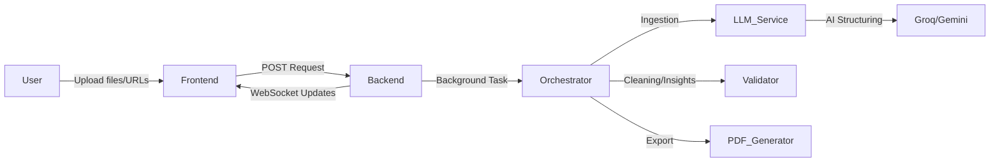

# ATOM8: AI-Powered Data Structurizer & Insights Platform

**Atom8** is a state-of-the-art visual AI platform designed to transform messy, unstructured multimedia data into clean, structured datasets. By leveraging high-performance LLMs (Groq & Gemini), it provides a seamless pipeline for data extraction, normalization, and forensic analysis.


---

## 🚀 Overview

Atom8 automates the tedious process of manual data entry and cleaning. Whether you have scanned invoices, messy CSVs, or unstructured web content, Atom8's orchestrator cleans, merges, and validates the data, delivering it in JSON or CSV formats along with a comprehensive "Data Autopsy" PDF report.

### Key Features
- **Visual AI Extraction**: Directly extract structured information from multimedia and unstructured sources.
- **Micro-Orchestration Pipeline**: Multi-stage processing including Extraction, Merging, Noise Removal, and AI Structuring.
- **Direct CSV Conversion**: High-efficiency path that bypasses JSON intermediate for faster CSV processing.
- **Data Autopsy Reports**: Professional PDF reports generated by AI that analyze data health, error patterns, and AI readiness.
- **Multi-LLM Support**: Seamlessly switch between Groq (Llama 3) and Google Gemini.
- **Real-time Monitoring**: WebSocket-based progress tracking from ingestion to export.

---

## 🏗️ Architecture

Atom8 uses a modern decoupled architecture:

- **Frontend**: A sleek, reactive dashboard built with **Next.js 15**, **Tailwind CSS**, and **Framer Motion**. It uses **Zustand** for lightweight state management and provides a premium "Glassmorphism" aesthetic.
- **Backend**: A robust **FastAPI** server that manages long-running AI orchestration tasks. It utilizes **BackgroundTasks** for non-blocking processing and **WebSockets** for real-time UI updates.



---

## 🛠️ Tech Stack

### Frontend
- **Framework**: Next.js 15 (App Router)
- **Language**: TypeScript
- **Styling**: Tailwind CSS, PostCSS
- **Animations**: Framer Motion, Motion
- **State**: Zustand
- **Icons**: Lucide React

### Backend
- **Framework**: FastAPI
- **LLM Engine**: Groq (Llama 3.3 70B), Gemini 2.5 Flash Lite
- **PDF Core**: ReportLab
- **Data Processing**: Pandas, Unstructured.io
- **Package Manager**: UV

---

## 🚦 Getting Started

### Prerequisites
- Node.js 18+
- Python 3.10+
- API Keys for Groq and/or Google Gemini

### Installation

1. **Clone the repository:**
   ```bash
   git clone https://github.com/riteshgharat/atom8.git
   cd atom8
   ```

2. **Setup Backend:**
   Follow instructions in [backend/README.md](backend/README.md).

3. **Setup Frontend:**
   Follow instructions in [frontend/README.md](frontend/README.md).

---

## 📄 Documentation

- [Direct CSV Feature Details](DIRECT_CSV_FEATURE.md)
- [PDF Report Generation Feature](PDF_REPORT_FEATURE.md)

---

## 🛡️ License
Atom8 is developed for hackathon purposes. All rights reserved.